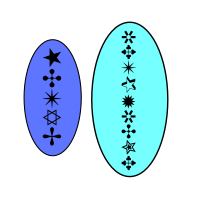

# Batch Encrypter

This script was an attempt at writing a program that encrypts and decrypts
files. Not a lot of development has actually taken place though and as a
result this program isn't really ready for use.

## Further Information

* [Changelog](CHANGELOG)
* [License](LICENSE)
* [Gitlab](https://gitlab.namibsun.net/namibsun/museum/batch-encrypter)
* [Github](https://github.com/namboy94/batch-encrypter)
* [Progstats](https://progstats.namibsun.net/projects/batch-encrypter)
